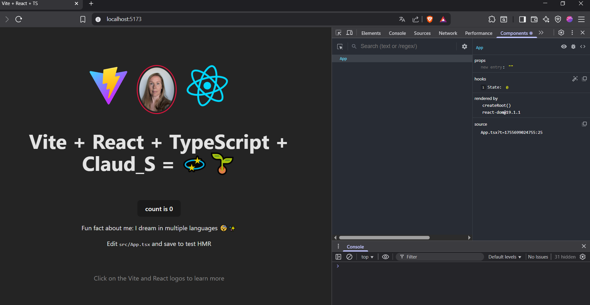

# My first React + Vite + TypeScript Project - interactive_frontend_work_req_1 🧩

My introductory project built with **React**, **Vite**, and **TypeScript**.  
It includes a simple display of my name & a fun fact about me, in addition to hot module replacement (HMR) for fast development and ESLint rules for code quality.

## 🚀 About

This project is designed as a minimal and modern setup for building React applications.  
It focuses on simplicity, speed, and clean code conventions.

## Technologies Used

- React
- TypeScript
- Vite vite@7.1.3
- Node.js v22.17.1
- ESLint
- Editor: VS Code
- Prettier (VS Code Plug-In, optional)
- React DevTools (see Screenshot)

### ✨ Features

- React with TypeScript support
- React DevTools (Browser Plug-In for e.g. Chrome & Firefox)
- Vite for fast development and builds
- ESLint and Prettier for code consistency
- Hot Module Replacement (HMR)
- Screenshot showing the props/state tree in the React DevTools 
  to give you a glimpse about the visuals. 

---



---

## 🛠️ Getting Started

### Prerequisites

You should have a solid understanding of HTML5, CSS3 and JavaScript.
Preferably worked with an Editor like VS Code or Phoenix beforehand and have
basic knowledge about working with the terminal (built-in in VS Code).

Before running this project, make sure you have the following installed:

#### 1. Node.js

This project requires Node.js version 18 or higher.  
Download it from the [official website](https://nodejs.org/) and follow the installer instructions for your operating system (Windows, macOS, or Linux).

To check your installation, run:

```bash
node -v 
```
It should print a version >= 18

#### 2. npm (Node Package Manager) or Yarn

- npm comes automatically with Node.js
- Check your version in the terminal:

```bash
npm -v
```

Yarn is an alternative package manager. To install it globally:

```bash
npm install -g yarn
```

#### 3. Vite + React + TypeScript Setup

To create a new project with Vite:

```bash
npm create vite@latest my-project 
```
creates new project folder
### or

```bash
npm create vite@latest . 
```
If you already have an empty folder & want to start from there.
### or

```bash
yarn create vite@latest my-project
```

## During the setup, you'll be asked to select a framework and variant (navigate with arrow-keys ⬆⬇):

**Framework**: select React <br>
**Variant**: select TypeScript <br>


# Install dependencies in terminal:

You will be prompted to run:

```bash
npm install 
```
to install dependencies with Node or
```
yarn (for yarn)
```
followed by:

```
npm run dev
``` 
to start the development server or
```
yarn dev 
```
for yarn

## Installation (Existing Project):

Clone the repository and install dependencies:

```bash
git clone <repository-url>
cd interactive_frontend_work_req_1
npm install
```

### Run the Project
Start the development server:

```
npm run dev
```
The app will be available at http://localhost:5173.

📖 Usage <br>
This project can be used as a foundation. You can copy the repository
and build your own version or use it as look-up.

🤝 Contributing<br>
Contributions are welcome!<br>
Please fork the repository and open a pull request.

## Available Scripts
```
npm run dev 
```
Start development server
```
npm run build
```
Build for production
```
npm run preview 
```
Preview production build locally
```
npm run lint
```
Run ESLint